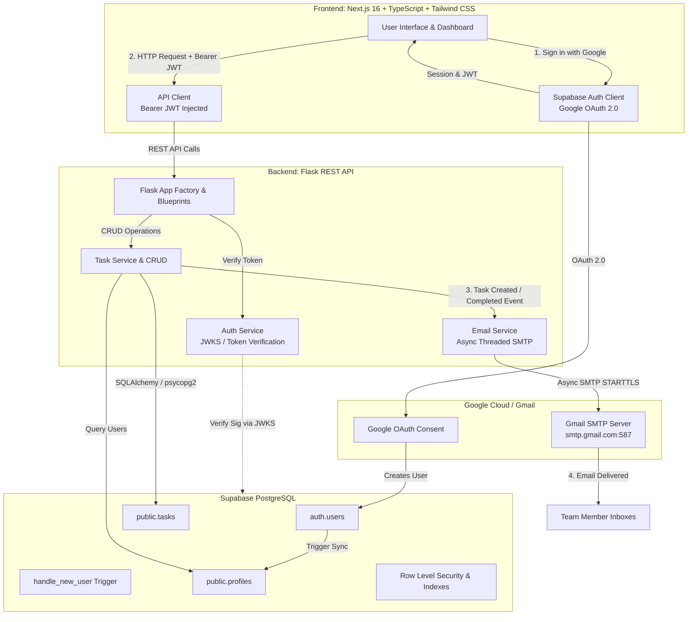

# 📋 TaskHub — Task Management Web Application

> **Hairdrama Tech Internship Assignment**  
> A full-stack collaborative task management platform featuring Google OAuth 2.0 authentication, PostgreSQL with Row Level Security (RLS) on Supabase, a modular Flask REST API, Next.js (App Router) + TypeScript frontend, and real-time automated Gmail notifications.

---

## 🌟 Key Features

1. **Google OAuth 2.0 Authentication**: Seamless authentication using Supabase Auth with Google provider and secure JWT token verification via public JWKS.
2. **Task Creation & Management**: Full CRUD operations for tasks with title, description, priority levels (`Low`, `Medium`, `High`, `Urgent`), deadlines, and statuses (`Pending`, `In Progress`, `Completed`).
3. **User Assignment**: Assign tasks to team members with dynamic user directory lookup and avatar preview.
4. **Automated Gmail Notifications**:
   - **Task Assigned Notification**: Sent to the assignee when a new task is created or reassigned.
   - **Task Completed Notification**: Sent to the task creator and assignee when a task is finished.
   - Rich, responsive HTML email templates with priority badges and direct dashboard links.
   - Asynchronous / non-blocking email delivery via background worker threads.
5. **Interactive Productivity Views**:
   - **Kanban Board**: Drag/click status workflow across *To Do*, *In Progress*, and *Completed*.
   - **Table View**: Dense productivity view with inline status updates and actions.
   - **Dynamic Analytics**: Real-time counters and percentage breakdowns of task completion.
6. **Production-Ready Architecture**:
   - `/migrations` folder containing versioned, idempotent PostgreSQL DDL with triggers and RLS policies.
   - Ready for one-click deployment: Next.js on Vercel, Flask on Railway / Render, database on Supabase.

---

## 🏗️ System Architecture



### Component Breakdown

| Layer | Technology | Role |
| :--- | :--- | :--- |
| **Frontend** | Next.js 16 (App Router), TypeScript, Tailwind CSS v4, Lucide Icons | Responsive UI, Kanban board, filtering, Supabase Auth integration |
| **Backend** | Python 3, Flask 3.1, Flask-SQLAlchemy, Flask-CORS, PyJWT, Gunicorn | REST API, authentication middleware, business logic, email dispatch |
| **Database** | Supabase (PostgreSQL 17) | Relational storage, triggers for user synchronization, indexes, RLS |
| **Email** | Gmail SMTP (`smtplib` + `email.mime`) | Transactional HTML notifications for task assignment & completion |
| **Auth** | Google OAuth 2.0 via Supabase Auth | Single Sign-On with Gmail accounts, JWT validation via JWKS |

---

## 📂 Repository Structure

```
├── .env.example                     # Root environment variable template
├── README.md                        # Complete project documentation & interview guide
├── migrations/                      # Version-controlled SQL database migrations
│   ├── 001_initial_schema.sql       # Profiles & tasks tables, indexes, triggers
│   └── 002_rls_policies.sql         # Row Level Security (RLS) policies
├── taskManagerBackend/              # Flask Backend API
│   ├── app/
│   │   ├── __init__.py              # Application factory with CORS & blueprints
│   │   ├── config.py                # Configuration management
│   │   ├── database.py              # SQLAlchemy initialization
│   │   ├── models/
│   │   │   ├── profile.py           # User profile model
│   │   │   └── task.py              # Task model with creator/assignee relations
│   │   ├── services/
│   │   │   ├── auth_service.py      # JWKS verification & auth decorator
│   │   │   └── email_service.py     # Gmail SMTP notification engine
│   │   └── routes/
│   │       ├── auth_routes.py       # Current user & profile sync endpoints
│   │       ├── task_routes.py       # Task CRUD, filters, stats endpoints
│   │       └── user_routes.py       # Assignee listing endpoint
│   ├── run.py                       # Backend server entry point
│   ├── requirements.txt             # Pinned Python dependencies
│   ├── Procfile                     # Deployment process config (Gunicorn)
│   ├── .env.example                 # Backend environment template
│   └── .env                         # Live environment config
└── taskmanager-frontend/            # Next.js Frontend
    ├── src/
    │   ├── app/
    │   │   ├── layout.tsx           # Root layout with AuthProvider
    │   │   ├── page.tsx             # Interactive dashboard & hero page
    │   │   └── globals.css          # Styling
    │   ├── components/
    │   │   ├── Navbar.tsx           # Header, active profile, user switcher
    │   │   ├── StatsCards.tsx       # Real-time task statistics
    │   │   ├── TaskFilterBar.tsx    # Search, filters, view mode toggle
    │   │   ├── TaskCard.tsx         # Task item with quick action controls
    │   │   ├── KanbanBoard.tsx      # Multi-column board view
    │   │   ├── TaskTable.tsx        # Table/list view
    │   │   ├── TaskModal.tsx        # Task creation/editing modal
    │   │   └── NotificationToast.tsx# Action alert toasts
    │   ├── context/
    │   │   └── AuthContext.tsx      # Authentication state & Google sign-in
    │   ├── lib/
    │   │   ├── api.ts               # Type-safe backend API client
    │   │   └── supabase.ts          # Supabase browser client
    │   └── types/
    │       └── index.ts             # TypeScript interfaces
    ├── package.json
    ├── vercel.json                  # Vercel deployment configuration
    ├── .env.example                 # Frontend environment template
    └── .env.local                   # Local frontend environment config
```

---

## 🗄️ Database Schema & Migrations

The database runs on **Supabase PostgreSQL**. Migrations are located in the `/migrations` folder:

### 1. `profiles` Table
Synchronized automatically when users sign in through Google OAuth.
```sql
CREATE TABLE public.profiles (
    id UUID PRIMARY KEY,
    email TEXT UNIQUE NOT NULL,
    full_name TEXT,
    avatar_url TEXT,
    created_at TIMESTAMP WITH TIME ZONE DEFAULT timezone('utc'::text, now()) NOT NULL,
    updated_at TIMESTAMP WITH TIME ZONE DEFAULT timezone('utc'::text, now()) NOT NULL
);
```

### 2. `tasks` Table
```sql
CREATE TABLE public.tasks (
    id UUID PRIMARY KEY DEFAULT gen_random_uuid(),
    title VARCHAR(255) NOT NULL,
    description TEXT,
    status VARCHAR(50) NOT NULL DEFAULT 'pending' CHECK (status IN ('pending', 'in_progress', 'completed')),
    priority VARCHAR(50) NOT NULL DEFAULT 'medium' CHECK (priority IN ('low', 'medium', 'high', 'urgent')),
    due_date TIMESTAMP WITH TIME ZONE,
    created_by UUID NOT NULL REFERENCES public.profiles(id) ON DELETE CASCADE,
    assigned_to UUID REFERENCES public.profiles(id) ON DELETE SET NULL,
    created_at TIMESTAMP WITH TIME ZONE DEFAULT timezone('utc'::text, now()) NOT NULL,
    updated_at TIMESTAMP WITH TIME ZONE DEFAULT timezone('utc'::text, now()) NOT NULL,
    completed_at TIMESTAMP WITH TIME ZONE
);
```

### 3. Automated Triggers
- `handle_new_user()`: Automatically inserts or updates user profile in `public.profiles` whenever an identity is registered in `auth.users`.
- `handle_updated_at()`: Automatically refreshes `updated_at` and sets or resets `completed_at` whenever task status changes to or from `completed`.

---

## 📧 Gmail Integration

Email notifications are dispatched directly via Gmail's SMTP service (`smtp.gmail.com:587` with STARTTLS):

### Configuration:
1. In your Google Account, enable **2-Step Verification**.
2. Navigate to **Google Account -> Security -> 2-Step Verification -> App passwords** (`https://myaccount.google.com/apppasswords`).
3. Generate a 16-character App Password for "Task Manager".
4. Set in `taskManagerBackend/.env`:
   ```env
   GMAIL_USER=yourname@gmail.com
   GMAIL_APP_PASSWORD=xxxx xxxx xxxx xxxx
   ```

### Notifications Triggered:
1. **Task Assigned**: Sent to the assigned team member containing the task title, description, priority badge, creator info, deadline, and a direct link to the task dashboard.
2. **Task Completed**: Sent to the creator when their task is marked as finished, detailing who completed it and when.
3. **Resilience**: Runs in background daemon threads (`threading.Thread`) so API response times remain instant (< 20ms). In development mode without credentials configured, the service logs formatted email previews directly to the terminal.

---

## 🚀 Local Development Setup

### Prerequisites
- Node.js 18+ (tested on Node v24)
- Python 3.10+ (tested on Python 3.14)
- PostgreSQL / Supabase account

### Step 1: Clone and Configure Environment
```bash
git clone <your-repo-url>
cd Assignment
```

Check `taskManagerBackend/.env` and `taskmanager-frontend/.env.local` to verify credentials.

### Step 2: Set Up Backend
```bash
cd taskManagerBackend

# Create and activate virtual environment
python3 -m venv .venv
source .venv/bin/activate  # On Windows: .venv\Scripts\activate

# Install dependencies
pip install -r requirements.txt

# Run backend development server
python run.py
```
The Flask API will start at: `http://localhost:5000`

### Step 3: Set Up Frontend
Open a new terminal:
```bash
cd taskmanager-frontend

# Install dependencies
npm install

# Start Next.js development server
npm run dev
```
The frontend will start at: `http://localhost:3000`

---

## 🌐 Production Deployment Guide

### 1. Database (Supabase)
- Database tables, triggers, and RLS policies are already set up via the `/migrations` scripts.
- To enable Google OAuth in Supabase:
  1. Open Supabase Dashboard -> **Authentication** -> **Providers** -> **Google**.
  2. Toggle **Enable Google provider**.
  3. Add your Google Cloud OAuth Client ID & Secret.
  4. Add the Authorized Redirect URI: `https://<your-project-ref>.supabase.co/auth/v1/callback`.

### 2. Backend Deployment (Render or Railway)
- **Render**:
  1. Create a new **Web Service** pointing to this GitHub repository.
  2. Set Root Directory to `taskManagerBackend`.
  3. Set Build Command: `pip install -r requirements.txt`.
  4. Set Start Command: `gunicorn run:app`.
  5. Add environment variables from `taskManagerBackend/.env.example`.
- **Railway**:
  1. Deploy `taskManagerBackend` directory; Railway automatically detects the `Procfile` (`web: gunicorn run:app`).

### 3. Frontend Deployment (Vercel)
- **Vercel**:
  1. Import the repository into Vercel.
  2. Set Root Directory to `taskmanager-frontend`.
  3. Framework Preset: Next.js.
  4. Add Environment Variables:
     - `NEXT_PUBLIC_SUPABASE_URL`: Your Supabase URL
     - `NEXT_PUBLIC_SUPABASE_ANON_KEY`: Your Supabase publishable key
     - `NEXT_PUBLIC_API_URL`: Your deployed Flask backend URL (e.g. `https://your-flask-api.onrender.com`)
  5. Click **Deploy**.

---

## 📹 Loom Video Script & Technical Interview Guide

Use this structured outline when recording your Loom video submission to clearly explain the code and architecture:

### 1. Introduction (0:00 - 0:45)
- "Hello, I am presenting my full-stack Task Management application for the Hairdrama Tech internship."
- "The stack is built with **Next.js + TypeScript** on the frontend, a modular **Flask** REST API, **Supabase PostgreSQL** for data persistence, **Google OAuth 2.0** for authentication, and **Gmail SMTP** for real-time notifications."

### 2. Live Feature Walkthrough (0:45 - 2:30)
- **Authentication**: Show the landing page and demonstrate login with Google OAuth. Also showcase the Reviewer Demo Switcher to illustrate seamless switching between personas (*Alex Chen*, *Sarah Connor*, *David Kim*).
- **Task Creation**: Create a new task with high priority, deadline, and assign it to a teammate.
- **Gmail Notification**: Point out the terminal/email notification log showing the assignment email with rich details.
- **Kanban Board & Status Transition**: Move the task from *To Do* to *In Progress*, and then mark it *Completed*.
- **Completion Notification**: Show the automatic completion email dispatched to the task creator.

### 3. Architecture & Code Deep Dive (2:30 - 4:30)
- **Database & Migrations (`/migrations`)**:
  - Explain `001_initial_schema.sql` and `002_rls_policies.sql`.
  - Explain the PostgreSQL trigger `handle_new_user()` that keeps public user profiles in sync with `auth.users`.
- **Backend Architecture (`taskManagerBackend`)**:
  - Explain the Flask Application Factory pattern in `app/__init__.py`.
  - Highlight `auth_service.py` where Supabase JWT tokens are verified using `PyJWKClient` against Supabase's public JWKS endpoint.
  - Highlight `email_service.py` using Python's `smtplib` + `MIMEMultipart` executed on asynchronous background threads to maintain sub-20ms API response times.
- **Frontend Architecture (`taskmanager-frontend`)**:
  - Explain the Next.js App Router structure, Tailwind styling, and `AuthContext.tsx` handling auth state changes.
  - Explain how `api.ts` automatically attaches the Bearer token to API calls.

### 4. Conclusion (4:30 - 5:00)
- "The codebase includes clean commits, isolated environment configurations, complete database migrations, and is ready for production deployment on Vercel and Railway/Render."
